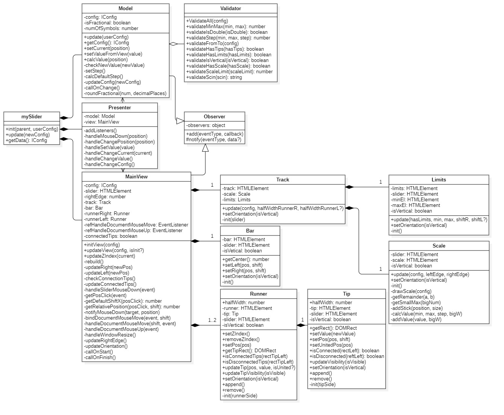

# The 4th task from FSD by Misha Yakubchuk
Независимый, кастомизируемый плагин jQuery, реализующий функционал "бегунка"(слайдера), с MVP архитектурой.

### Содержание
1. [Демонстрация](#demo)
2. [npm команды](#npm)
3. [Инициализация плагина](#init)
4. [Javascript API](#api)
5. [Архитектура](#arch)
6. [UML-диаграмма](#uml)

### Демонстрация <a name="demo"></a> 
[Демо страница](https://fanmanutd.github.io/The-4th-task-by-Misha-Yakubchuk/output/demo-page/demo-page.html)

[Больше слайдеров богу слайдеров](https://fanmanutd.github.io/The-4th-task-by-Misha-Yakubchuk/output/more-sliders/more-sliders.html)

Использованные библиотеки:
- упаковщик [parceljs](https://en.parceljs.org/)
- препроцессор-шаблонизатор [pug](https://gist.github.com/neretin-trike/53aff5afb76153f050c958b82abd9228)
- препроцессор [sass(scss)](https://sass-lang.com/)
- [typescript](https://www.typescriptlang.org/)
- фреймворк для тестирования [jest](https://jestjs.io/ru/)

### npm команды <a name="npm"></a> 
- Установка проекта: `npm install`
- Запуск: `npm run start`
- Сборка: `npm run build`
- Тесты: `npm run test`
- Покрытие: `npm run coverage`

### Инициализация плагина <a name="init"></a> 
Плагин инициализируется на любом пустом div-элементе.  
Инициализация с параметрами по умолчанию:
```js
$('#selector').mySlider();
```
Инициализация с пользовательсиким параметрами:
```js
const config = {
  min: 200,
  max: 500,
  from: 250,
  to: 350,
  double: true,
};

$('#selector').mySlider(config);
```
Инициализация через data атрибуты:
```html
<div class="new-slider" data-min="100" data-max="900" data-vertical="true"></div>
```
```js
$('.new-slider').mySlider();
```
Использование публичных методов:
```js
const mySlider = $('#selector').mySlider().data('mySlider');

// Обновление состояния слайдера
mySlider.update({
  from: 250,
  to: 670,
});

// Получение состояние слайдера
const sliderData = mySlider.getData();
```
Использование коллбэков:
```js
const config = {
  onStart: function (data) {
    console.log(data.min);
  },
  
  onChange: function (data) {
    console.log(data.double);
  },
  
  onFinish: function (data) {
    console.log(data.to);
  },
};

$('#selector').mySlider(config);
```
### Javascript API <a name="api"></a> 
| Параметр                            | По умолчанию | Тип     | Описание                                                                                     |
|:------------------------------------|:------------:|:-------:|:---------------------------------------------------------------------------------------------|
| min<br>```data-min```               | 0            | number  | Устанавливает минимальное значение слайдера.                                                 |
| max<br>```data-max```               | 1000         | number  | Устанавливает максимальное значение слайдера.                                                |
| from<br>```data-from```             | 400          | number  | Устанавливает значение левого бегунка.                                                       |
| to<br>```data-to```                 | 700          | number  | Устанавливает значение правого бегунка (или одиночного, при double - false).                 |
| step<br>```data-step```             | 1            | number  | Устанавливает значение шага, всегда > 0. Может быть дробным. Если шаг не задан, а минимальньное или максимальное                                                                  значение слайдера - дробное число, значение шага высчитывается и становится дробным.         |
| double<br>```data-double```         | false        | boolean | Устанавливает диапазоновый слайдер.                                                          |
| tips<br>```data-tips```             | true         | boolean | Показывает/скрывает значение над бегунками.                                                  |
| minMax<br>```data-min-max```        | false        | boolean | Показывает/скрывает минимальное и максимальное значения слайдера. Не используйте в вертикальном слайдере с                                                                        включённой шкалой(scale).                                                                    |
| scale<br>```data-scale```           | false        | boolean | Показывает/скрывает шкалу значений.                                                          |
| scaleNum<br>```data-scale-num```    | 4            | number  | Устанавливает количество больших полосок на шкале.                                           |
| scaleSnap<br>```data-scale-snap```  | false        | boolean | Привязывает шкалу к значению шага слайдера(step). Если активирован, scaleNum не учитывается. |
| vertical<br>```data-vertical```     | false        | boolean | Устанавливает вертикальное положение слайдера.                                               |
| scin<br>```data-scin```             | orange       | string  | Устанавливает скин. Доступные: orange, darkcongo, whitered, azure, indigo.                    |

Коллбэки:
| Параметр | По умолчанию | Тип      | Описание |
|:---------|:------------:|:--------:|:---------|
| onStart  | null         | function | Вызывается при нажатии ЛКМ по бегунку/треку/шкале. |
| onChange | null         | function | Вызывается при движении мыши с зажатой ЛКМ.        |
| onFinish | null         | function | Вызывается при отпускании ЛКМ.                     |  

Во всех коллбэках доступен объект data, содержащий все вышеперечисленные параметры.

Публичные методы:
| Имя     | Тип возвращаемого значения | Описание |
|:--------|:--------------------------:|:---------|
| update  | null                       | Обновляет состояние слайдера. Принимает объект, который может содержать любые вышеперечисленные свойства. |
| getData | object                     | Возвращает объект data, который содержит все вышеперечисленные параметры.                                 |

### Архитектура <a name="arch"></a> 
Приложение спроектировано с использованием архитектуры MVP и разделено на 3 слоя: Model, View, Presenter.

Model - слой, который содержит бизнес-логику приложения и занимается расчётами, связанными только с ней(напр. валидация и расчёт новых значений).  
View - слой, который отображает приложение пользователю и реагирует на действия пользователя. Содержит расчёты, связанные только с отображением.  
Presenter - единственный слой, который знает о Model и View, является посредником между ними.

Общение между слоями происходит с использованием шаблона "Наблюдатель"(Observer). Model и View реализуют шаблон "Наблюдатель", оповещая о своём изменении всех желающих, а Presenter подписан на эти оповещения. Presenter реагирует на сообщения об изменении Model и обновляет View, а так же реагирует на сообщения от View о действиях пользователя и обновляет Model.

Так же слой View декомпозирован на MainView и SubViews. Каждый SubView отвечает за свой компонент приложения(бегунок, шкала и т.д.).
Когда пользователь совершает клик по контейнеру, в котором находится слайдер, MainView анализирует клик.  
- Если клик(или движение мыши с зажатой ЛКМ) был совершён по бегунку, треку или шкале, MainView оповещает Presenter о действии пользователя, передавая позицию клика. 
- Presenter реагирует на сообщение от MainView и передаёт позицию клика Model. 
- Model расчитывает новое значение и оповещает Presenter об изменении. 
- Presenter реагирует на сообщение от Model и вызывает метод обновления у MainView. 
- MainView обновляет необходимые SubViews на основе полученных значений. 

 ### UML-диаграмма <a name="uml"></a> 

